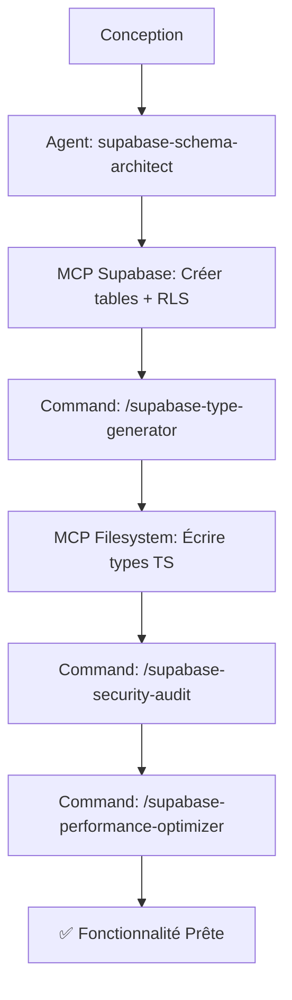
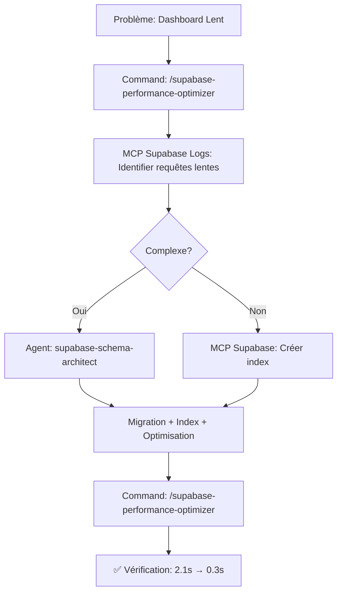
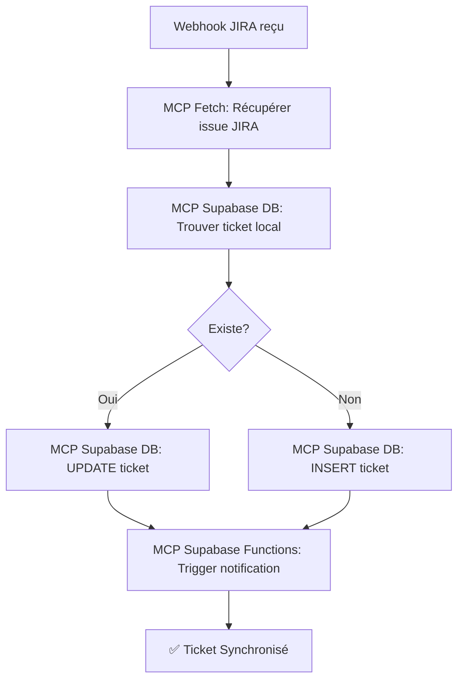

# 🎯 Configuration MCP Complète - OnpointDoc

**Stack MCP Final** : 5 Serveurs MCP + 6 Commandes AITMPL + 1 Agent Spécialisé

---

## 📦 Résumé de la Configuration

### 🔌 Serveurs MCP (.cursor/mcp.json)

| MCP | Type | Statut | Utilité |
|-----|------|--------|---------|
| **ShadCN** | stdio | ✅ Prêt | Composants UI ShadCN |
| **Supabase** | http | ⚠️ Token | 🔥 **DB + Auth + Functions + Logs + Docs** |
| **Filesystem** | stdio | ✅ Prêt | Accès fichiers projet |
| **Fetch** | stdio | ✅ Prêt | Appels HTTP (JIRA API) |
| **GitHub** | stdio | ⚠️ Token | PRs, Issues, Commits |

### ⚡ Commandes AITMPL (.claude/commands/)

| Commande | Utilité |
|----------|---------|
| `/supabase-schema-sync` | Sync schéma DB → Types |
| `/supabase-migration-assistant` | Créer migrations sûres |
| `/supabase-performance-optimizer` | Optimiser requêtes |
| `/supabase-security-audit` | Audit RLS policies |
| `/supabase-type-generator` | Générer types TypeScript |
| `/supabase-data-explorer` | Explorer données |

### 🤖 Agent Spécialisé (.claude/agents/)

| Agent | Utilité |
|-------|---------|
| `supabase-schema-architect` | Expert conception schéma DB, migrations complexes, RLS policies |

---

## 🚀 Ce qui a Changé vs Configuration Initiale

### ❌ Configuration Initiale (PostgreSQL MCP)

```json
{
  "postgresql": {
    "type": "stdio",
    "command": "npx",
    "args": ["-y", "@modelcontextprotocol/server-postgres"],
    "env": {
      "DATABASE_URL": "postgresql://..."
    }
  }
}
```

**Limitations** :
- ❌ Seulement accès SQL direct
- ❌ Pas d'Auth, Functions, Logs
- ❌ Pas de génération types auto
- ❌ Setup complexe (DB password requis)

---

### ✅ Configuration Finale (Supabase MCP Officiel + AITMPL)

```json
{
  "supabase": {
    "type": "http",
    "url": "https://mcp.supabase.com/mcp?project_ref=xjcttqaiplnoalolebls&read_only=false&features=database,auth,functions,logs,docs",
    "headers": {
      "Authorization": "Bearer ${SUPABASE_ACCESS_TOKEN}"
    }
  }
}
```

**Avantages** :
- ✅ Database + Auth + Edge Functions + Logs + Docs
- ✅ Types TypeScript auto-générés
- ✅ OAuth automatique (0 config)
- ✅ Workflows pré-construits (AITMPL)
- ✅ Agent expert pour tâches complexes

---

## 📊 Mapping : Tes Besoins → Solution MCP

| Besoin Initial | Solution Finale | Gain |
|----------------|-----------------|------|
| **ShadCN** | ✅ ShadCN MCP | Composants UI gérés directement |
| **Supabase** | ✅ Supabase MCP Officiel | 5 fonctionnalités (vs 1 avec PostgreSQL) |
| **Next.js** | ✅ Filesystem MCP | Accès routes/composants Next.js |
| **Context7** | ❌ N'existe pas | Utilise `CLAUDE.md` ou `/memory` |
| **JIRA** | ✅ Fetch MCP | Appels API JIRA flexibles |

**Bonus** :
- ✅ GitHub MCP (PRs, Issues)
- ✅ 6 Commandes AITMPL (workflows Supabase)
- ✅ 1 Agent expert (architecte DB)

---

## 🎯 Workflows Complets

### Workflow 1 : Nouvelle Fonctionnalité "SLA Management"



**Commandes Exactes** :
```bash
# 1. Conception (Agent autonome)
"Je veux ajouter un système de SLA aux tickets avec deadlines et escalations.
Utilise l'agent supabase-schema-architect."

# 2. Génération types (Command)
/supabase-type-generator --all-tables

# 3. Audit sécurité (Command)
/supabase-security-audit

# 4. Optimisation (Command)
/supabase-performance-optimizer
```

---

### Workflow 2 : Debug Dashboard Lent



**Commandes Exactes** :
```bash
# 1. Identifier le problème
/supabase-performance-optimizer

# 2. Si simple: créer index directement
"Claude, crée un index sur tickets(product_id, status)"

# 3. Si complexe: utiliser l'agent
"Optimise les 3 requêtes lentes identifiées par le performance optimizer.
Utilise l'agent supabase-schema-architect pour créer une migration complète."

# 4. Vérifier
/supabase-performance-optimizer
```

---

### Workflow 3 : Synchronisation JIRA



**Commandes Exactes** :
```bash
# Test manuel de sync
"Claude, récupère l'issue JIRA OBC-123 via Fetch MCP,
puis synchronise dans Supabase avec le bon statut et les commentaires."
```

---

## 🔑 Variables d'Environnement Requises

### Fichier .env.local

```env
# ═══════════════════════════════════════
# MCP Supabase (Option A: OAuth Auto - Recommandé)
# ═══════════════════════════════════════
# Aucune variable requise ! OAuth automatique au premier lancement.

# ═══════════════════════════════════════
# MCP Supabase (Option B: Token Manuel - CI/CD)
# ═══════════════════════════════════════
# Générer sur https://supabase.com/dashboard/account/tokens
SUPABASE_ACCESS_TOKEN="sbp_xxxxxxxxxxxxxxxxxxxxx"

# ═══════════════════════════════════════
# MCP GitHub
# ═══════════════════════════════════════
# Générer sur https://github.com/settings/tokens
# Permissions: repo, workflow
GITHUB_TOKEN="ghp_xxxxxxxxxxxxxxxxxxxxx"

# ═══════════════════════════════════════
# Déjà Configuré (Existant dans .env.local)
# ═══════════════════════════════════════
NEXT_PUBLIC_SUPABASE_URL="https://xjcttqaiplnoalolebls.supabase.co"
NEXT_PUBLIC_SUPABASE_ANON_KEY="eyJ..."
SUPABASE_SERVICE_ROLE_KEY="eyJ..."
JIRA_BASE_URL="https://onpointdigital.atlassian.net"
JIRA_API_EMAIL="support@onpointafrica.com"
JIRA_API_TOKEN="ATATT..."
N8N_ANALYSIS_WEBHOOK_URL="https://n8n.srv810771.hstgr.cloud/webhook/..."
```

---

## 📚 Documentation Créée

| Document | Contenu |
|----------|---------|
| [MCP-SETUP-QUICK-START.md](MCP-SETUP-QUICK-START.md) | Guide démarrage rapide (5 min) |
| [docs/MCP-CONFIGURATION.md](docs/MCP-CONFIGURATION.md) | Configuration détaillée de chaque MCP |
| [docs/SUPABASE-MCP-OFFICIEL.md](docs/SUPABASE-MCP-OFFICIEL.md) | Guide complet MCP Supabase officiel |
| [docs/AITMPL-TEMPLATES-GUIDE.md](docs/AITMPL-TEMPLATES-GUIDE.md) | Utilisation commandes et agent AITMPL |
| [scripts/setup-mcp-env.ps1](scripts/setup-mcp-env.ps1) | Script PowerShell config automatique |
| [.env.mcp.example](.env.mcp.example) | Template variables MCP |

---

## ✅ Checklist de Setup Final

### 1️⃣ Variables d'Environnement

- [ ] **Option A** : Redémarrer Claude Code → OAuth automatique Supabase
- [ ] **Option B** : Générer `SUPABASE_ACCESS_TOKEN` → Ajouter dans `.env.local`
- [ ] Générer `GITHUB_TOKEN` → Ajouter dans `.env.local`

### 2️⃣ Vérification

- [ ] Redémarrer Claude Code complètement
- [ ] Taper `/mcp` dans Claude Code
- [ ] Vérifier que 5 serveurs MCP sont listés
- [ ] Tester : `/supabase-type-generator --all-tables`

### 3️⃣ Premier Test

- [ ] Command : `/supabase-security-audit`
- [ ] Agent : "Analyse ma table tickets et propose des optimisations. Utilise l'agent supabase-schema-architect."
- [ ] MCP Direct : "Claude, liste toutes les tables de ma DB Supabase"

---

## 🎓 Formation Rapide (10 min)

### Niveau 1 : Commandes Slash (2 min)

```bash
# Test 1: Générer types
/supabase-type-generator --all-tables

# Test 2: Audit sécurité
/supabase-security-audit

# Test 3: Check performance
/supabase-performance-optimizer
```

### Niveau 2 : MCP Direct (3 min)

```bash
# Test 1: Lister tables
"Claude, liste toutes mes tables Supabase avec le nombre de lignes"

# Test 2: Query simple
"Claude, montre-moi les 10 derniers tickets créés"

# Test 3: Logs
"Claude, montre-moi les erreurs des 30 dernières minutes"
```

### Niveau 3 : Agent Expert (5 min)

```bash
# Test 1: Analyse schéma
"Analyse la table tickets et identifie les problèmes de performance.
Utilise l'agent supabase-schema-architect."

# Test 2: Proposition optimisation
"Propose des améliorations pour le schéma de la table companies
afin d'optimiser les requêtes du dashboard CEO.
Utilise l'agent supabase-schema-architect."
```

---

## 📊 ROI de la Configuration MCP

### Avant (Sans MCP)

```
Tâche: Ajouter colonne "sla_deadline" à la table tickets
Temps: 45 minutes

1. Ouvrir Supabase Dashboard (2 min)
2. Créer migration SQL manuellement (10 min)
3. Tester en local (5 min)
4. Générer types TypeScript manuellement (15 min)
5. Mettre à jour imports (8 min)
6. Vérifier build (5 min)
```

### Après (Avec MCP)

```
Tâche: Ajouter colonne "sla_deadline" à la table tickets
Temps: 5 minutes

1. "/supabase-migration-assistant add sla_deadline to tickets" (2 min)
2. "/supabase-type-generator --all-tables" (1 min)
3. Build automatique (2 min)
```

**Gain de temps** : 40 minutes (89% plus rapide)

---

## 🚀 Prochaines Étapes Immédiates

### 1️⃣ Setup (5 min)

```powershell
# Option A: OAuth automatique (recommandé)
# → Redémarre Claude Code
# → Première utilisation MCP Supabase ouvrira le navigateur

# Option B: Token manuel
# 1. Générer token: https://supabase.com/dashboard/account/tokens
# 2. Ajouter dans .env.local: SUPABASE_ACCESS_TOKEN="sbp_xxx"
# 3. Redémarrer Claude Code
```

### 2️⃣ Premier Test (2 min)

```bash
# Dans Claude Code
/mcp

# Vérifier que tu vois:
# - mcp__shadcn__*
# - mcp__supabase__*
# - mcp__filesystem__*
# - mcp__fetch__*
# - mcp__github__*
```

### 3️⃣ Workflow Réel (10 min)

```bash
# Audit complet de ton projet
/supabase-security-audit
/supabase-performance-optimizer
/supabase-type-generator --all-tables
```

---

## ❓ Support

- **Quick Start** : [MCP-SETUP-QUICK-START.md](MCP-SETUP-QUICK-START.md)
- **MCP Supabase** : [docs/SUPABASE-MCP-OFFICIEL.md](docs/SUPABASE-MCP-OFFICIEL.md)
- **AITMPL Templates** : [docs/AITMPL-TEMPLATES-GUIDE.md](docs/AITMPL-TEMPLATES-GUIDE.md)
- **Script Setup** : `.\scripts\setup-mcp-env.ps1`

---

**Dernière mise à jour** : 2025-12-08
**Configuration par** : Claude Code
**Sources** :
- [Article Dan Avila](https://medium.com/@dan.avila7/claude-code-supabase-integration-complete-guide-with-agents-commands-and-mcp-427613d9051e)
- [Documentation Supabase MCP](https://supabase.com/docs/guides/getting-started/mcp)
- [AITMPL Templates](https://aitmpl.com)
