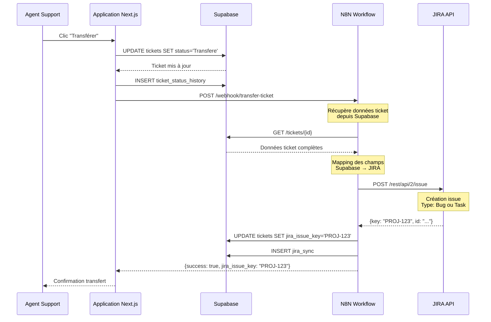
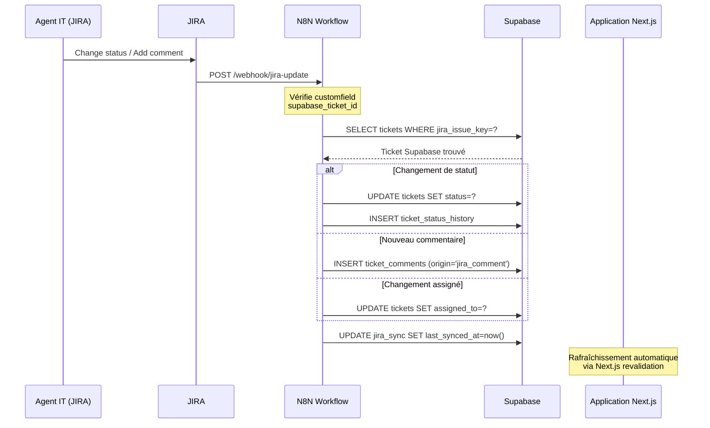

# Intégration N8N / JIRA - Documentation des Workflows

Ce document décrit les workflows d'automatisation entre Supabase, N8N et JIRA pour la gestion des tickets OnpointDoc.

## Vue d'ensemble

L'intégration permet :
1. **Transfert Assistance → JIRA** : Transférer un ticket Assistance non résolu vers JIRA pour traitement IT
2. **Synchronisation JIRA → Supabase** : Remonter les statuts, commentaires et assignations depuis JIRA vers Supabase

## Architecture

```
┌─────────────┐         ┌─────────────┐         ┌─────────────┐
│   Supabase  │ ──────> │     N8N    │ ──────> │    JIRA     │
│  (Frontend) │         │ (Orchestre) │         │  (Backend)  │
└─────────────┘         └─────────────┘         └─────────────┘
       ▲                        │                       │
       │                        │                       │
       └────────────────────────┴───────────────────────┘
                    (Webhooks JIRA)
```

## Workflow 1 : Transfert Assistance → JIRA

### Déclencheur

L'utilisateur Support clique sur le bouton **"Transférer vers JIRA"** sur un ticket Assistance en statut `En_cours`.

### Flux détaillé



### Mapping des champs Supabase → JIRA

| Champ Supabase | Champ JIRA | Transformation |
|----------------|------------|----------------|
| `title` | `summary` | Direct |
| `description` | `description` | Enrichi avec contexte client |
| `canal` | `labels` | Ajout label `canal:{canal}` |
| `priority` | `priority` | Mapping : Low→Lowest, Medium→Medium, High→High, Critical→Highest |
| `product_id` | `labels` | Ajout label `product:{product_name}` |
| `module_id` | `labels` | Ajout label `module:{module_name}` |
| `ticket.id` | `customfield_supabase_ticket_id` | UUID du ticket Supabase (pour liaison inverse) |
| `ticket_type` | `issuetype` | ASSISTANCE → Bug ou Task (selon configuration) |

### Payload N8N Webhook

```json
{
  "ticket_id": "uuid-du-ticket",
  "title": "Titre du ticket",
  "description": "Description du problème",
  "canal": "Whatsapp",
  "priority": "Medium",
  "product_id": "uuid-produit",
  "module_id": "uuid-module",
  "customer_context": "Contexte client optionnel",
  "action": "transfer_to_jira"
}
```

### Configuration N8N

**Workflow N8N : `transfer-assistance-to-jira`**

1. **Trigger : Webhook** (`/webhook/transfer-ticket`)
   - Méthode : POST
   - Authentification : Bearer token (optionnel)

2. **Node : Supabase - Get Ticket**
   - Récupère les détails complets du ticket
   - Inclut les relations (product, module)

3. **Node : Function - Map to JIRA Format**
   - Transforme les données Supabase en format JIRA
   - Enrichit la description avec contexte client

4. **Node : JIRA - Create Issue**
   - Project Key : Configuré dans N8N
   - Issue Type : Bug (ou Task selon configuration)
   - Mapping des champs selon tableau ci-dessus

5. **Node : Supabase - Update Ticket**
   - Met à jour `jira_issue_key` dans la table `tickets`
   - Enregistre dans `jira_sync`

6. **Node : Respond to Webhook**
   - Retourne `{success: true, jira_issue_key: "PROJ-123"}`

## Workflow 2 : Synchronisation JIRA → Supabase

### Déclencheur

Webhook JIRA configuré pour écouter :
- `issue_updated` (changement de statut, assignation, priorité)
- `comment_created` (nouveau commentaire)
- `issue_created` (création d'issue - pour vérification)

### Flux détaillé



### Mapping des statuts JIRA → Supabase

| Statut JIRA | Statut Supabase | Notes |
|-------------|-----------------|-------|
| `To Do` | `To_Do` | Direct |
| `In Progress` | `En_cours` | Direct |
| `Done` | `Resolue` | Direct |
| `Closed` | `Resolue` | Direct (ou statut dédié si nécessaire) |

### Configuration N8N

**Workflow N8N : `sync-jira-to-supabase`**

1. **Trigger : Webhook JIRA**
   - URL : Configurée dans JIRA Settings → Webhooks
   - Événements : `jira:issue_updated`, `comment_created`

2. **Node : Function - Extract Ticket ID**
   - Extrait `customfield_supabase_ticket_id` ou `issue.key`
   - Vérifie si le ticket est lié à Supabase

3. **Node : Supabase - Get Ticket by JIRA Key**
   - Recherche le ticket Supabase correspondant

4. **Node : Switch - Event Type**
   - Route selon le type d'événement (status, comment, assignee)

5. **Node : Supabase - Update/Insert**
   - Met à jour le ticket ou insère dans l'historique/comments
   - Définit `last_update_source='jira'` pour éviter les boucles

6. **Node : Supabase - Update jira_sync**
   - Met à jour `last_synced_at` et `sync_error` si erreur

### Payload Webhook JIRA

```json
{
  "webhookEvent": "jira:issue_updated",
  "issue": {
    "key": "PROJ-123",
    "fields": {
      "status": {
        "name": "In Progress"
      },
      "assignee": {
        "emailAddress": "it.agent@example.com"
      },
      "customfield_10001": "uuid-supabase-ticket"
    }
  },
  "changelog": {
    "items": [
      {
        "field": "status",
        "fromString": "To Do",
        "toString": "In Progress"
      }
    ]
  }
}
```

## Règles anti-boucle

Pour éviter les boucles infinies de synchronisation :

1. **Champ `last_update_source`** dans `tickets`
   - `'supabase'` : Dernière mise à jour depuis l'application
   - `'jira'` : Dernière mise à jour depuis JIRA

2. **Logique N8N**
   - Si `last_update_source='jira'` et mise à jour depuis Supabase → Ne pas renvoyer vers JIRA
   - Si `last_update_source='supabase'` et mise à jour depuis JIRA → Ne pas renvoyer vers Supabase

3. **Champ `origin`** dans `ticket_status_history` et `ticket_comments`
   - Permet de distinguer l'origine des données dans l'UI

## Variables d'environnement

### Application Next.js

```env
N8N_WEBHOOK_URL=https://n8n.example.com/webhook/transfer-ticket
N8N_API_KEY=your-n8n-api-key  # Optionnel
```

### N8N

```env
SUPABASE_URL=https://your-project.supabase.co
SUPABASE_SERVICE_ROLE_KEY=your-service-role-key
JIRA_URL=https://your-company.atlassian.net
JIRA_EMAIL=your-email@example.com
JIRA_API_TOKEN=your-api-token
JIRA_PROJECT_KEY=PROJ
```

## Gestion des erreurs

### Erreurs de transfert

- **N8N indisponible** : Le statut est mis à jour dans Supabase, mais le ticket JIRA n'est pas créé. Un retry manuel est nécessaire.
- **JIRA API error** : N8N enregistre l'erreur dans `jira_sync.sync_error` pour diagnostic.

### Erreurs de synchronisation

- **Ticket non trouvé** : N8N ignore l'événement (ticket créé directement dans JIRA).
- **Erreur Supabase** : N8N enregistre dans `jira_sync.sync_error` et peut retry selon configuration.

## Tests et validation

### Test du transfert

1. Créer un ticket Assistance en statut `En_cours`
2. Cliquer sur "Transférer vers JIRA"
3. Vérifier :
   - Statut = `Transfere` dans Supabase
   - Entrée dans `ticket_status_history`
   - Ticket créé dans JIRA avec le bon mapping
   - `jira_issue_key` renseigné dans Supabase

### Test de la synchronisation

1. Modifier le statut d'un ticket dans JIRA
2. Vérifier :
   - Statut mis à jour dans Supabase
   - Entrée dans `ticket_status_history` avec `origin='jira'`
   - `last_synced_at` mis à jour dans `jira_sync`

## Maintenance

### Monitoring

- Surveiller `jira_sync.sync_error` pour détecter les erreurs récurrentes
- Vérifier `last_synced_at` pour détecter les tickets non synchronisés
- Logs N8N pour diagnostiquer les problèmes de workflow

### Mises à jour

- Ajout de nouveaux champs : Mettre à jour le mapping dans N8N
- Changement de statuts : Mettre à jour les enums Supabase et le mapping N8N
- Nouveaux produits/modules : Vérifier que les labels JIRA sont correctement générés

